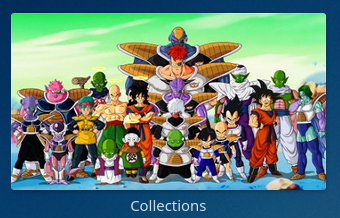

# Library Covers TL;DR

## Install

`pip install jellyfin-tools`

## Use

`jellyfin-tools cover create --image /path/to/image.png --title Library`

# Overview
The purpose of this library is to share (non-plugin) tools I use for managing my Jellyfin instance and/or media library.

Currently, the only functionality of this library is to generate images with Jellyfin-like styling (shadow overlay and 
library title text) from source images. 
This was created because Jellyfin's included functionality to use a custom image as a library cover doesn't run its own 
styling library on the custom image.

# Installation

> **Prerequisites:** [Python/pip](https://www.python.org/downloads/)

## Stable

`pip install jellyfin-tools`

## From Git Repo *(Newer, Less Stable)*

`pip install git+https://github.com/eebette/jellyfin-tools`

## Manual Install

### Download

`git clone https://github.com/eebette/Jellyfin-Tools`

### Install

`pip install ./Jellyfin-Tools`

# Usage

## Jellyfin Library Covers

> `jellyfin-tools cover create --image /path/to/image.png --title Library`

This is a command for decorating an existing image to match the styling of a defualt library cover generated by Jellyfin
or Emby. By default, it resizes the image, adds a shadow overlay, and enters the text in the correct font and color.
Features of Jellyfin/Emby styling were manually reverse-matched by analyzing the image file that was output for a media
collection in Jellyfin. 

>ℹ️  It is recommended to use a️n image which is already in `16:9` (1080p) aspect ratio

### Destination option

You can use the `--destination ` flag to provide a destination path to which to write the file. A path must be provided,
 but the file name is optional. 

### Styling Options

You can use the `--shadow ` flag to give a `0.0`-`1.0` percentage transparency to the shadow overlay. 
Use `0` for no shadow darkening of the cover image. For example:

> `jellyfin-tools create --image /path/to/image.png --title Library --shadow 0`

# Tools
## `cover`
### The Problem
Here's what a Jellyfin-generated library image looks like.

Unfortunately, this image is randomly generated from the backdrops of the media in the library, so if we get one we 
don't like, we just have to keep generating new ones until we get one that looks good.

---
Here's what a custom library image looks like when used as a custom library cover in Jellyfin:

There's no styling applied. 

### The Solution

Call the `jellyfin-tools cover create` CLI in this package to apply styling to your image which will match Jellyfin's auto-generated 
styling. It will also resize the image for optimal use by Jellyfin in order to not take up any unnecessary storage on 
your server!

`jellyfin-tools cover create --image /path/to/image.png --title Library`

You can also generate multiple at the same time: 

`jellyfin-tools cover create --image /path/to/image/1.png /path/to/image/2.png --title Library1 Library2`

>❗ ️Note that you'll need to include quotes for a library title which includes spaces, or else the CLI doesn't know how to
parse it correct. Example: 

`jellyfin-tools cover create --image /path/to/image/1.png /path/to/image/2.png --title Movies "Home Movies"`

Much better!

# FAQ

## I got a message saying `libraqm and/or fribidi dll's are not found!`

This probably means that you're on Windows, which is (sometimes) missing some dll's which are critical for some 
functionality in the Python package Pillow. This includes the ability to scale, color, and draw on the base image 
within this package.

Answering affirmatively to the prompt will run a short script to "install" those dll's into your local Python
environment:
1) The `libraqm` `.zip` file is copied from this repository
2) The correct dll for your architecture (x64 or x86) is moved into the directory containing your `python.exe`

>❗ Note that uninstalling this package or Python from your system will likely not delete these files. Please manually
> delete them if you do not want them on your system.