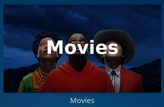
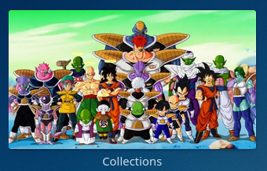
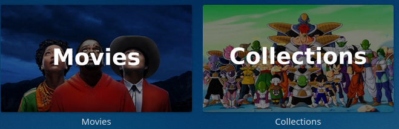

# Library Covers TL;DR

## Install

`pip install jellyfin-tools`

## Use

`jellyfin-tools cover create --image /path/to/image.png --title Library`

# Overview
The purpose of this library is to share (non-plugin) tools I use for managing my Jellyfin instance and/or media library.

Currently, the only functionality of this library is to generate images with Jellyfin-like styling (shadow overlay and 
library title text) from source images. 
This was created because Jellyfin's included functionality to use a custom image as a library cover doesn't run its own 
styling library on the custom image.

# Installation

> **Prerequisites:** [Python/pip](https://www.python.org/downloads/)

## Stable

`pip install jellyfin-tools`

## From Git Repo *(Newer, Less Stable)*

`pip install git+https://github.com/eebette/jellyfin-tools`

## Manual Install

### Download

`git clone https://github.com/eebette/Jellyfin-Tools`

### Install

`pip install ./Jellyfin-Tools`

> ℹ️ There are no system dependencies beyond Python. Image processing and text rendering are pure Pillow, which ships
> prebuilt wheels for every platform — no OpenCV, no libGL, nothing to apt-install.

## Docker

No local Python needed — images are published to GitHub Container Registry for `amd64` and `arm64`
([#17](https://github.com/eebette/jellyfin-tools/issues/17)). Mount the directory containing your images at `/data`:

```sh
docker run --rm -v "$(pwd):/data" ghcr.io/eebette/jellyfin-tools cover create --image /data/art.png --title Movies
```

Or with the [`docker-compose.yml`](docker-compose.yml) from this repository:

```sh
docker compose run --rm jellyfin-tools cover create --image /data/art.png --title Movies
```

The output lands next to the source image (or wherever `--destination` points, as long as it's under `/data`).

> ℹ️ The container runs as root by default, so generated files will be root-owned. Add
> `--user "$(id -u):$(id -g)"` to the `docker run` command to write them as your own user.

# Usage

## Jellyfin Library Covers

> `jellyfin-tools cover create --image /path/to/image.png --title Library`

This is a command for decorating an existing image to match the styling of a defualt library cover generated by Jellyfin
or Emby. By default, it resizes the image, adds a shadow overlay, and enters the text in the correct font and color.
Features of Jellyfin/Emby styling were manually reverse-matched by analyzing the image file that was output for a media
collection in Jellyfin. 

>ℹ️  It is recommended to use a️n image which is already in `16:9` (1080p) aspect ratio

### Destination option

You can use the `--destination ` flag to provide a destination path to which to write the file. A path must be provided,
 but the file name is optional. 

### Styling Options

You can use the `--shadow ` flag to give a `0.0`-`1.0` percentage transparency to the shadow overlay. 
Use `0` for no shadow darkening of the cover image. For example:

> `jellyfin-tools create --image /path/to/image.png --title Library --shadow 0`

### Custom font option

You can use the `--font` flag to provide a path to your own font file (any FreeType-supported format, e.g. `.ttf` or
`.otf`) to use for the title text instead of the bundled Prima Sans Bold:

> `jellyfin-tools cover create --image /path/to/image.png --title Эфир --font /path/to/DejaVuSans-Bold.ttf`

The bundled font only covers Latin characters, so this is needed for titles in other scripts — Cyrillic, Greek, etc.
([#10](https://github.com/eebette/jellyfin-tools/issues/10)).

>❗ Text is rendered without complex-script shaping: scripts that require joining or reordering (Arabic, Hebrew with
> points, Indic scripts, Thai) will not render correctly even with a font that covers them.


# Tools
## `cover`
### The Problem
Here's what a Jellyfin-generated library image looks like.



Unfortunately, this image is randomly generated from the backdrops of the media in the library, so if we get one we 
don't like, we just have to keep generating new ones until we get one that looks good.

---
Here's what a custom library image looks like when used as a custom library cover in Jellyfin:



There's no styling applied. 

### The Solution


Call the `jellyfin-tools cover create` CLI in this package to apply styling to your image which will match Jellyfin's auto-generated 
styling. It will also resize the image for optimal use by Jellyfin in order to not take up any unnecessary storage on 
your server!

`jellyfin-tools cover create --image /path/to/image.png --title Library`

You can also generate multiple at the same time: 

`jellyfin-tools cover create --image /path/to/image/1.png /path/to/image/2.png --title Library1 Library2`

>❗ ️Note that you'll need to include quotes for a library title which includes spaces, or else the CLI doesn't know how to
parse it correct. Example: 

`jellyfin-tools cover create --image /path/to/image/1.png /path/to/image/2.png --title Movies "Home Movies"`



Much better!

# FAQ

## Older versions asked me to install dll's (`libraqm and/or fribidi dll's are not found!`)

Versions up to `1.0.2` shipped an interactive installer that tried to download Windows dll's for Pillow's `raqm`
text-shaping engine. On Linux and macOS this could never succeed (Windows dll's don't load there), which caused an
endless install prompt loop ([#8](https://github.com/eebette/jellyfin-tools/issues/8)).

As of `1.1.0` the CLI doesn't use `raqm` at all, so there is nothing to install and no prompt on any platform. `raqm`
was only ever used to switch off kerning, and Pillow's basic layout engine doesn't apply kerning in the first place —
so the covers come out the same, without depending on a system library that may or may not be present.

A side benefit: rendering no longer varies by machine. Previously the same title could produce slightly different
covers depending on whether `fribidi` happened to be installed.

The dll archive the old installer downloaded has also been removed from this repository, so on `1.0.2` and earlier the
prompt now fails with a download error instead of installing anything. There is nothing to repair — upgrade instead:

`pip install --upgrade jellyfin-tools`

## My library title has accented characters and they aren't rendering

This was fixed in `1.1.0`. Titles are normalised to Unicode NFC before rendering, so `é` renders correctly whether it
arrives composed (one codepoint) or decomposed (an `e` followed by a combining accent). The decomposed form is what
macOS uses for filenames, so it turns up whenever a title is derived from a path — for example:

`jellyfin-tools cover create --image "$dir/fanart.jpg" --title "$(basename "$dir")"`

Before `1.1.0`, that case dropped the accents and pushed the text off the edge of the cover.